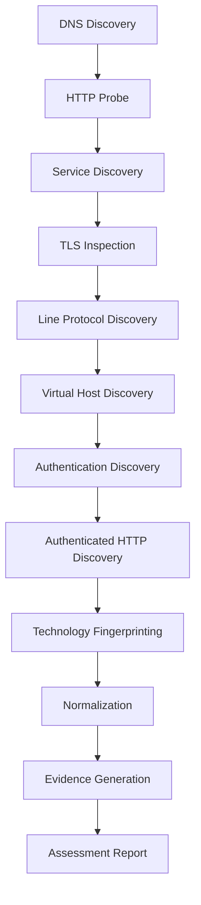

# Recon Engine

[](https://www.python.org/downloads/)
[](LICENSE)
[](https://github.com/psf/black)
[](https://docs.astral.sh/ruff/)
[](https://docs.pytest.org/)
[](https://www.kali.org/)
[](#project-status)

**Deterministic, scope-aware reconnaissance with evidence integrity for authorized assessments.**

Recon Engine is a modular Python reconnaissance platform that automates authorized attack-surface discovery—from DNS resolution through authenticated foothold retrieval—then normalizes results, generates chain-of-custody evidence, and produces an assessment report suitable for technical review.

> **Authorized use only.** This project is designed for lab environments, educational assessments, and engagements where written authorization exists. Do not use it against systems you do not own or lack permission to test.

---

## Professional Overview

Built as a production-style cybersecurity engineering project, Recon Engine emphasizes:

| Principle | Implementation |
|-----------|----------------|
| **Scope safety** | Explicit target/assignment validation before discovery |
| **Determinism** | Ordered discovery pipeline with reproducible artifact layout |
| **Evidence integrity** | SHA-256 manifests, continuity records, and attestation files |
| **Traceability** | Request ledger, evidence index, and scope register |
| **Modularity** | Adapters → discovery modules → normalizer → evidence → reporting |

The engine wraps familiar Kali tooling (`dig`, `curl`, `nmap`, `openssl`) behind typed Python adapters so operators get structured JSON/CSV/Markdown/PDF outputs instead of ad-hoc shell transcripts.

---

## Feature Highlights

- Scope-aware reconnaissance against authorized targets
- DNS discovery via `dig`
- HTTP/HTTPS reachability probing via `curl`
- Service enumeration via `nmap`
- TLS certificate and protocol inspection via `openssl`
- Line-protocol and virtual-host discovery
- Authentication and authenticated HTTP discovery
- HTTP technology fingerprinting
- Discovery normalization into a consistent schema
- Evidence generation (manifests, ledgers, attestations)
- Attack-surface PDF reporting
- Manifest integrity verification (`manifest.sha256`)

<details>
<summary><strong>Full capability matrix</strong></summary>

| Area | Capabilities |
|------|----------------|
| Discovery | DNS, probe, service, TLS, line protocol, vhost, auth, authenticated HTTP, fingerprint |
| Normalization | Stable section schema across all discovery modules |
| Evidence | `normalized.json`, scope register, request ledger, evidence index, assessment manifest, continuity record, integrity attestation, foothold evidence, SHA-256 manifest |
| Reporting | Executive summary, findings, recommendations, appendix, PDF assembly |
| Operations | CLI entrypoint, assignment JSON, optional YAML config, resume flag, output directory control |

</details>

---

## Architecture Overview

```text
┌─────────────────────────────────────────────────────────────┐
│                        ReconEngine                          │
│              (src/recon/engine/recon_engine.py)             │
└───────────────┬─────────────────┬───────────────────────────┘
                │                 │
        ┌───────▼───────┐ ┌───────▼────────┐ ┌────────────────┐
        │   Discovery   │ │    Evidence    │ │   Reporting    │
        │ Orchestrator  │ │  Orchestrator  │ │  Orchestrator  │
        └───────┬───────┘ └───────┬────────┘ └────────┬───────┘
                │                 │                   │
        ┌───────▼───────┐ ┌───────▼────────┐ ┌────────▼───────┐
        │   Adapters    │ │ Artifact       │ │ PDF / Markdown │
        │ dig curl nmap │ │ Writers        │ │  Generators    │
        │ openssl …     │ │                │ │                │
        └───────────────┘ └────────────────┘ └────────────────┘
```

<details>
<summary><strong>Package layout (logical)</strong></summary>

| Package | Responsibility |
|---------|----------------|
| `recon.configuration` | CLI parsing, config/assignment loading, scope & environment checks |
| `recon.adapters` | Thin wrappers around external recon tools |
| `recon.discovery` | Ordered discovery modules + normalizer |
| `recon.evidence` | Assessment artifact writers + integrity hashing |
| `recon.reporting` | Report sections + PDF generation |
| `recon.engine` | Top-level workflow coordination |

</details>

---

## Discovery Workflow



```text
DNS → Probe → Service → TLS → Line Protocol → Virtual Host
  → Authentication → Authenticated HTTP → Fingerprint
  → Normalize → Evidence → Report
```

---

## Project Structure

```text
recon-engine-portfolio/
├── .github/                 # Issue/PR templates, CI, Dependabot
├── docs/                    # Architecture & engineering docs
├── examples/                # Realistic usage examples
├── screenshots/             # Portfolio screenshot placeholders
├── deliverables/            # Assessment archive guidance
├── output/                  # Runtime artifacts (gitignored contents)
├── reports/                 # Optional report staging
├── resources/               # Templates, schemas, fixtures
├── scripts/                 # Operator helper scripts
├── src/recon/               # Application package
│   ├── adapters/
│   ├── configuration/
│   ├── discovery/
│   ├── engine/
│   ├── evidence/
│   └── reporting/
├── tests/                   # Unit / integration / acceptance
├── CONTRIBUTING.md
├── SECURITY.md
├── CHANGELOG.md
├── ROADMAP.md
├── CODE_OF_CONDUCT.md
├── LICENSE
├── pyproject.toml
└── README.md
```

---

## Installation

```bash
git clone https://github.com/mulingealex/recon-engine-portfolio.git
cd recon-engine-portfolio

python -m venv .venv
source .venv/bin/activate   # Windows: .venv\Scripts\activate

pip install -e .
```

Editable install exposes the `recon` package under `src/`.

---

## Requirements

| Component | Notes |
|-----------|--------|
| Python | 3.13+ |
| OS | Kali Linux recommended (tooling assumed) |
| `dig` | DNS discovery |
| `curl` | HTTP probing / authenticated requests |
| `nmap` | Service enumeration |
| OpenSSL | TLS inspection |
| PyYAML | Assignment/config loading (install via environment as needed) |

---

## Quick Start

```bash
# Using a Stage 5 / lab assignment file
PYTHONPATH=src python -m recon \
  --assignment /path/to/assignment.json

# Direct target (authorized lab host only)
PYTHONPATH=src python -m recon 127.0.0.1
```

Artifacts are written to `output/` by default (`--output` to override).

---

## Usage

```bash
PYTHONPATH=src python -m recon --help
```

| Argument | Description |
|----------|-------------|
| `target` | Hostname, `host:port`, or URL (optional if `--assignment` is set) |
| `--assignment` | Path to runtime assignment JSON |
| `--config` | Optional YAML configuration |
| `--output` | Artifact directory (default: `output`) |
| `--resume` | Resume a previous assessment |

Configuration precedence: **CLI → YAML → assignment JSON**.

---

## Example Execution

```bash
PYTHONPATH=src python -m recon \
  --assignment examples/sample_assignment.json \
  --output output
```

Expected console flow:

```text
========================================
Recon Engine
========================================
Target: 127.0.0.1

[1/3] Running discovery...
✓ Discovery completed.

[2/3] Generating evidence...
✓ Evidence generated.

[3/3] Generating report...
✓ Report generated.

========================================
Assessment completed successfully.
========================================
```

See [`examples/`](examples/) for additional operator recipes.

---

## Example Output

```text
output/
├── assessment-manifest.json
├── attack-surface-report.pdf
├── continuity-record.md
├── evidence-index.csv
├── foothold-evidence.txt
├── integrity-attestation.md
├── manifest.sha256
├── normalized.json
├── request-ledger.csv
├── scope-register.csv
└── raw-output/
    ├── dns.json
    ├── probe.json
    └── …
```

<details>
<summary><strong>Sample normalized excerpt</strong></summary>

```json
{
  "probe": {
    "reachable": true,
    "http": true,
    "status_code": 200,
    "target": "http://127.0.0.1:18408"
  },
  "services": {
    "services": [
      {
        "port": 18408,
        "protocol": "tcp",
        "state": "open",
        "service": "unknown"
      }
    ]
  },
  "fingerprint": {
    "technologies": [
      "TransitGateway/2.4",
      "Runtime:P5"
    ]
  }
}
```

</details>

---

## Evidence Generation

Every run produces a verifiable evidence pack:

| Artifact | Purpose |
|----------|---------|
| `normalized.json` | Canonical discovery schema |
| `scope-register.csv` | Authorized scope record |
| `request-ledger.csv` | Request/response traceability |
| `evidence-index.csv` | Index of generated evidence |
| `assessment-manifest.json` | Assessment metadata |
| `continuity-record.md` | Chain-of-custody narrative |
| `integrity-attestation.md` | Integrity statement |
| `foothold-evidence.txt` | Authenticated foothold proof (when obtained) |
| `manifest.sha256` | SHA-256 hashes of artifacts |
| `attack-surface-report.pdf` | Human-readable assessment report |

Verify integrity after a run by inspecting `manifest.sha256` and comparing file hashes.

---

## Testing

```bash
PYTHONPATH=src pytest tests/unit -v
```

JUnit XML (local only; gitignored):

```bash
PYTHONPATH=src pytest tests/unit --junitxml=test-results.xml
```

Compile check:

```bash
python -m compileall src
```

---

## Technologies Used

- **Language:** Python 3.13
- **Packaging:** setuptools / `pyproject.toml`
- **Testing:** pytest
- **Style:** Black, Ruff, mypy (configured)
- **External tools:** dig, curl, nmap, OpenSSL
- **Artifacts:** JSON, CSV, Markdown, PDF
- **Platform:** Kali Linux

---

## Design Decisions

1. **Adapters over shell scripts** — Tool invocation is isolated so discovery logic stays testable and readable.
2. **Orchestrators per subsystem** — Discovery, evidence, and reporting evolve independently without coupling.
3. **Normalize once** — Downstream writers consume a single schema, not raw tool output.
4. **Hash last** — `ManifestWriter` runs after other artifacts so integrity covers the full pack.
5. **Assignment-first lab mode** — Supports educational runtimes while remaining usable with a direct target.

More detail: [`docs/engineering-decisions.md`](docs/engineering-decisions.md).

---

## Future Roadmap

See [`ROADMAP.md`](ROADMAP.md) for the full plan. Highlights:

- Richer TLS and certificate analytics
- Optional plugin interface for custom discovery modules
- Expanded integration / acceptance tests
- Containerized demo lab profile
- HTML report companion to PDF

---

## Known Limitations

- Requires local system tools (`dig`, `curl`, `nmap`, `openssl`); not a pure-Python network stack
- Optimized for Kali / Unix-like environments
- Authentication discovery depends on prior virtual-host / line-protocol success
- PDF reporting depends on the reporting subsystem’s runtime dependencies
- Not a replacement for a full commercial ASM / attack-surface platform
- Intended for authorized lab and assessment use only

---

## Screenshots

> Place real captures in `screenshots/` after a local authorized run. References below are intentional placeholders.

| Capture | Path | Description |
|---------|------|-------------|
| CLI run | [`screenshots/cli-execution.png`](screenshots/cli-execution.png) | Engine completing discovery → evidence → report |
| Evidence tree | [`screenshots/evidence-artifacts.png`](screenshots/evidence-artifacts.png) | `output/` artifact layout |
| Normalized JSON | [`screenshots/normalized-json.png`](screenshots/normalized-json.png) | Structured discovery output |
| PDF report | [`screenshots/attack-surface-report.png`](screenshots/attack-surface-report.png) | Generated assessment PDF |
| Integrity | [`screenshots/manifest-sha256.png`](screenshots/manifest-sha256.png) | `manifest.sha256` verification view |

See [`screenshots/README.md`](screenshots/README.md).

---

## Contributing

Contributions that improve documentation, tests, DX, and non-breaking quality are welcome.

1. Read [`CONTRIBUTING.md`](CONTRIBUTING.md) and [`CODE_OF_CONDUCT.md`](CODE_OF_CONDUCT.md)
2. Open an issue using the templates in [`.github/ISSUE_TEMPLATE/`](.github/ISSUE_TEMPLATE/)
3. Submit a PR using [`.github/PULL_REQUEST_TEMPLATE.md`](.github/PULL_REQUEST_TEMPLATE.md)

Security issues: follow [`SECURITY.md`](SECURITY.md)—do not open public issues for vulnerabilities.

---

## License

Released under the [MIT License](LICENSE).

Originally developed for educational assessment under the **UBI Advanced Programme – Ethical Hacking / VAPT (Stage 5)**, and maintained as a public portfolio / open-source project.

---

## Author

**Alex M. Mulinge**  
Cybersecurity Analyst · Vulnerability Assessment · Linux Security  
Nairobi, Kenya

- **GitHub:** [github.com/mulingealex](https://github.com/mulingealex)
- **LinkedIn:** [linkedin.com/in/alex-mulinge-448708361](https://www.linkedin.com/in/alex-mulinge-448708361)
- **Email:** mulingealex68@gmail.com

---

## Project Status

| Area | Status |
|------|--------|
| Discovery pipeline | Complete |
| Authenticated foothold path | Complete |
| Evidence generation | Complete |
| Report generation | Complete |
| Unit tests | Passing |
| Portfolio / OSS packaging | In progress (this branch) |

---

<p align="center">
  <sub>Built for authorized reconnaissance · Evidence-first · Portfolio-grade engineering</sub>
</p>
